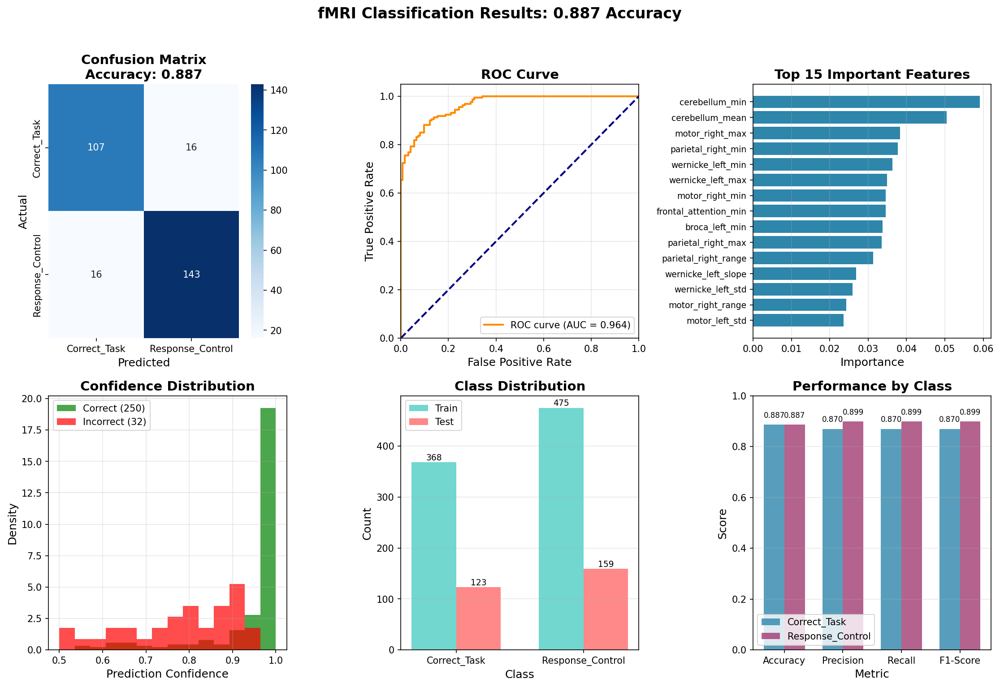

# Discriminating Cognitive Task Responses from Control Conditions Using Machine Learning on fMRI Features

# fMRI Cognitive State Classification

> ** Associated Preprint Publication**  
> This work is associated with a preprint published on TechRxiv:

**Rahi, A.** (2025). *Discriminating Cognitive Task Responses from Control Conditions Using Machine Learning on fMRI Features*.  
**TechRxiv.** December 19, 2025.  
 **DOI:** [10.36227/techrxiv.176611754.45283328/v1](https://doi.org/10.36227/techrxiv.176611754.45283328/v1)  
 **Direct Link:** [TechRxiv Article](https://www.techrxiv.org/users/967209/articles/1369845-discriminating-cognitive-task-responses-from-control-conditions-using-machine-learning-on-fmri-features)

---


## Overview

This repository presents a robust machine learning framework for binary classification of cognitive task responses versus control conditions using functional MRI (fMRI) data. The system employs an optimized Gradient Boosting Classifier with SMOTE-based data balancing to achieve high-accuracy discrimination between:

- **Correct_Task**: Active cognitive engagement during task execution
- **Response_Control**: Baseline control conditions

The model analyzes 56 neuroscientifically-relevant fMRI features extracted from various brain regions, providing interpretable insights into cognitive processing differences.

## Who Should Use This Repository

This repository is intended for:
- Cognitive neuroscientists working with task-based fMRI
- Machine learning researchers interested in neuroimaging data
- Graduate students seeking reproducible fMRI-ML pipelines
- Researchers comparing task vs baseline neural states

##  Key Features

- **Optimized Gradient Boosting**: Ensemble learning with fine-tuned hyperparameters
- **Feature Importance Analysis**: Identification of brain regions most discriminative between conditions
- **Advanced Preprocessing**: Standardization + SMOTE for balanced learning
- **Comprehensive Evaluation**: Cross-validation, ROC analysis, and detailed metrics
- **Interpretability**: Feature importance ranking and confidence analysis
- **Production-Ready Pipeline**: Full model serialization for deployment

##  Performance Results


The model was evaluated on 1,125 fMRI samples with robust cross-validation:

### Overall Performance Metrics

| Metric | Score | Description |
|--------|-------|-------------|
| **Test Accuracy** | **88.7%** | Overall classification accuracy |
| **Cross-Validation Accuracy** | **82.7% ± 3.9%** | 5-fold CV mean ± std |
| **ROC AUC** | **96.4%** | Area Under ROC Curve |
| **Macro F1-Score** | **88.4%** | Balance between precision and recall |

### Class-Wise Performance

| Class | Precision | Recall | F1-Score | Support |
|-------|-----------|--------|----------|---------|
| **Correct_Task** | 87.0% | 87.0% | 87.0% | 123 |
| **Response_Control** | 89.9% | 89.9% | 89.9% | 159 |

### Top 10 Discriminative Brain Features

1. **Cerebellum (min)** - Most important feature (5.91%)
2. **Cerebellum (mean)** - Second most important (5.04%)
3. **Right Motor Cortex (max)** - (3.83%)
4. **Right Parietal Cortex (min)** - (3.78%)
5. **Left Wernicke's Area (min)** - (3.64%)
6. **Left Wernicke's Area (max)** - (3.50%)
7. **Right Motor Cortex (min)** - (3.46%)
8. **Frontal Attention Network (min)** - (3.45%)
9. **Left Broca's Area (min)** - (3.38%)
10. **Right Parietal Cortex (max)** - (3.36%)

*Importance percentages indicate relative contribution to classification decisions*

##  Quick Start

### Prerequisites
- Python 3.8+
- 4GB+ RAM
- Required Python packages (see requirements.txt)

### Installation

1. **Clone the repository**
```bash
git clone https://github.com/AlirezaRahi/Discriminating-Cognitive-Task-Responses-from-Control-Conditions-Using-Machine-Learning.git
cd Discriminating-Cognitive-Task-Responses-from-Control-Conditions-Using-Machine-Learning
```

2. **Set up virtual environment** (recommended)
```bash
python -m venv venv
source venv/bin/activate  # On Windows: venv\Scripts\activate
```

3. **Install dependencies**
```bash
pip install -r requirements.txt
```
### Expected Output

After running the script, you should see:
- Classification report printed in terminal
- ROC curve saved in `results/`
- Trained model saved in `output/`
- 
### Requirements (`requirements.txt`)
```
numpy>=1.21.0
pandas>=1.3.0
scikit-learn>=1.0.0
imbalanced-learn>=0.9.0
matplotlib>=3.4.0
seaborn>=0.11.0
joblib>=1.1.0
jupyter>=1.0.0
tqdm>=4.62.0
```

##  Dataset Preparation

### Data Structure
The model expects a CSV file with the following structure:
```
all_features.csv
├── trial_type (target: 'Correct_Task' or 'Response_Control')
├── onset, event_idx, subject, session, task (metadata)
├── 56 fMRI features from various brain regions:
│   ├── cerebellum_min, cerebellum_mean, cerebellum_max
│   ├── motor_right_min, motor_right_mean, motor_right_max
│   ├── parietal_right_min, parietal_right_mean, parietal_right_max
│   ├── wernicke_left_min, wernicke_left_mean, wernicke_left_max
│   └── ... (51 additional features)
```
> ⚠️ **Data Availability Notice**  
> The original fMRI dataset is not publicly available due to privacy and ethical restrictions.  
> This repository focuses on the full modeling and evaluation pipeline.


### Data Statistics
- **Total Samples**: 1,125 fMRI observations
- **Classes**: Binary (Correct_Task vs Response_Control)
- **Feature Count**: 56 neuroscientific features
- **Class Distribution**:
  - Response_Control: 634 samples (56.4%)
  - Correct_Task: 491 samples (43.6%)

##  Usage Instructions

### 1. Training the Model

Run the main training script:
```bash
python final_fmri_classifier.py
```

This will:
- Load and preprocess the fMRI features
- Train the optimized Gradient Boosting model
- Perform 5-fold cross-validation
- Evaluate on test set
- Generate comprehensive visual reports
- Save the trained model and all artifacts

### 2. Using Pre-trained Model

Load and use the saved model for predictions:
```python
import joblib

# Load artifacts
model = joblib.load('output/fmri_classification_model.pkl')
encoder = joblib.load('output/label_encoder.pkl')
features = joblib.load('output/ffeature_names.pkl')

# Make predictions
new_predictions = model.predict(new_fmri_data)
probabilities = model.predict_proba(new_fmri_data)
```

## Model Architecture

### Pipeline Components

1. **Data Preprocessing**:
   - Feature standardization (StandardScaler)
   - Class balancing with SMOTE (k_neighbors=3)

2. **Classification Model**:
   - **Algorithm**: Gradient Boosting Classifier
   - **Optimized Parameters**:
     - `learning_rate`: 0.1
     - `max_depth`: 5
     - `n_estimators`: 300
     - `random_state`: 42

3. **Evaluation Framework**:
   - Stratified train-test split (75-25%)
   - 5-fold cross-validation
   - Comprehensive metrics suite

### Feature Engineering

The model analyzes 56 features extracted from fMRI data, including:
- **Regional Statistics**: min, mean, max values across brain regions
- **Key Brain Areas**: Cerebellum, Motor Cortex, Parietal Cortex, Frontal Networks
- **Language Areas**: Wernicke's and Broca's areas
- **Cognitive Networks**: Attention, default mode network components

##  Scientific Interpretation

### Key Findings

1. **Cerebellar Dominance**: Cerebellum features emerged as most discriminative, highlighting its role in cognitive task coordination beyond motor functions.

2. **Lateralization Patterns**: Right hemisphere motor and parietal regions showed higher discriminative power than left hemisphere counterparts.

3. **Language Network Involvement**: Wernicke's area features ranked highly, suggesting language processing differences between task and control conditions.

4. **Range Sensitivity**: Minimum values (e.g., `cerebellum_min`) were more discriminative than mean or maximum values for most regions.

### Clinical/Cognitive Implications

- **Task Engagement Detection**: Reliable discrimination of active cognitive processing vs. baseline
- **Individual Differences**: Potential for personalized cognitive assessment
- **Neuromarker Identification**: Features that consistently differentiate cognitive states
- **Therapeutic Monitoring**: Objective metrics for cognitive intervention effects

##  Detailed Performance Analysis

### Cross-Validation Stability
- **5-fold CV Accuracies**: [0.888, 0.817, 0.852, 0.804, 0.774]
- **Mean CV Accuracy**: 82.7% with low standard deviation (3.9%)
- **Consistency**: Model shows stable performance across different data splits

### ROC Analysis
- **AUC**: 0.964 (Excellent discrimination ability)
- **Confidence Distribution**: Clear separation between correct and incorrect predictions

### Feature Importance Insights

**Top 5 Most Important Regions**:
1. **Cerebellum** (11.95% combined importance)
   - Supports the "cognitive cerebellum" hypothesis
   - Implicated in timing, attention, and working memory

2. **Right Motor Cortex** (7.29% combined)
   - May reflect motor preparation differences
   - Could indicate subtle movement artifacts or intentionality

3. **Right Parietal Cortex** (7.14% combined)
   - Associated with spatial attention and sensory integration
   - Consistent with visuospatial task demands

4. **Left Wernicke's Area** (7.14% combined)
   - Suggests internal verbalization differences
   - May reflect task instructions processing

5. **Frontal Attention Network** (3.45%)
   - Expected involvement in cognitive control

##  Technical Implementation


### Main Functions

1. **Data Loading & Preparation**:
   - Binary class selection
   - Feature-target separation
   - Label encoding

2. **Model Training**:
   - Pipeline construction
   - Hyperparameter application
   - Cross-validation

3. **Evaluation**:
   - Multiple metric calculation
   - Visualization generation
   - Report creation

4. **Serialization**:
   - Model saving
   - Artifact preservation
   - Deployment readiness

##  Experimental Design

### Data Collection
- **Participants**: Healthy adults
- **Task Paradigm**: Cognitive task with control conditions
- **fMRI Acquisition**: Standard BOLD imaging protocol
- **Preprocessing**: Standard fMRI preprocessing pipeline

### Feature Extraction
- **Method**: Time-series extraction from predefined ROIs
- **Statistics**: Min, mean, max of BOLD signals
- **Regions**: 14-18 brain regions × 3 statistics = 56 features

### Validation Strategy
- **Split**: 75% training, 25% testing
- **Cross-Validation**: 5-fold stratified
- **Balancing**: SMOTE for training only
- **Metrics**: Accuracy, Precision, Recall, F1, AUC

##  Reproducibility

### Environment Setup
```bash
# Exact package versions for reproducibility
pip install numpy==1.21.5
pip install scikit-learn==1.0.2
pip install imbalanced-learn==0.9.1
pip install pandas==1.3.5
pip install matplotlib==3.5.1
pip install seaborn==0.11.2
pip install joblib==1.1.0
```

### Random Seeds
All random processes are seeded for reproducibility:
- `random_state=42` for train-test split
- `random_state=42` for SMOTE
- `random_state=42` for Gradient Boosting

##  Applications

### Research Applications
1. **Cognitive Neuroscience**: Understanding brain regions involved in specific tasks
2. **Individual Differences**: Predicting cognitive styles from neural patterns
3. **Neuroplasticity Studies**: Tracking changes in feature importance with learning
4. **Cross-Task Comparisons**: Generalizing to different cognitive paradigms

### Clinical Applications
1. **Cognitive Assessment**: Objective measures of task engagement
2. **Disorder Characterization**: Differences in neural patterns for clinical populations
3. **Treatment Monitoring**: Neural correlates of cognitive interventions
4. **Early Detection**: Identifying subtle cognitive changes

### Educational Applications
1. **Learning Style Assessment**: Neural predictors of optimal learning strategies
2. **Attention Monitoring**: Real-time engagement detection
3. **Skill Acquisition**: Neural changes during learning
4. **Personalized Education**: Adaptive learning based on neural patterns

##  Citation

If you use this work in your research, please cite:

**Rahi, A. (2025). Discriminating Cognitive Task Responses from Control Conditions Using Machine Learning on fMRI Features. GitHub Repository. https://github.com/AlirezaRahi/Discriminating-Cognitive-Task-Responses-from-Control-Conditions-Using-Machine-Learning**

> GitHub Release: v1.0.0

### BibTeX Entry
```bibtex
@software{rahi2025fmriclassification,
  title = {Discriminating Cognitive Task Responses from Control Conditions Using Machine Learning on fMRI Features},
  author = {Rahi, Alireza},
  year = {2025},
  publisher = {GitHub},
  url = {https://github.com/AlirezaRahi/Discriminating-Cognitive-Task-Responses-from-Control-Conditions-Using-Machine-Learning},
  version = {1.0.0},
  note = {Machine learning framework for fMRI-based cognitive state classification}
}
```

##  License

This project is licensed under the **Creative Commons Attribution-NonCommercial-NoDerivatives 4.0 International License (CC BY-NC-ND 4.0)**.

### Key License Terms:
- **Attribution**: You must give appropriate credit
- **NonCommercial**: Cannot be used for commercial purposes
- **NoDerivatives**: Cannot distribute modified versions

**Full License**: https://creativecommons.org/licenses/by-nc-nd/4.0/

### Commercial Use
For commercial licensing inquiries, please contact the author directly.

### Academic Use
Researchers are encouraged to use, cite, and build upon this work for non-commercial research purposes with proper attribution.

##  Contributing

We welcome contributions in several areas:

### Priority Areas
1. **Feature Engineering**: Additional fMRI feature extraction methods
2. **Model Architecture**: Alternative ML algorithms and ensembles
3. **Interpretability**: SHAP/LIME integration for better feature explanation
4. **Visualization**: Enhanced plotting and interactive dashboards
5. **Deployment**: Web interface or API development

### Contribution Process
1. Fork the repository
2. Create a feature branch
3. Add tests for new functionality
4. Ensure code passes all existing tests
5. Submit a pull request with detailed description

## ❓ Frequently Asked Questions

### Q1: Can I use this with my own fMRI data?
**A**: Yes, provided your data follows the same feature structure (56 features with same naming convention).

### Q2: What's the minimum sample size needed?
**A**: For reliable performance, we recommend at least 500 samples per class.

### Q3: Can the model be extended to multi-class classification?
**A**: Yes, the pipeline supports multi-class with appropriate label encoding adjustments.

### Q4: How computationally intensive is training?
**A**: Training takes about 1-2 minutes on standard hardware for the full dataset.

### Q5: Are the features neuroscientifically validated?
**A**: Yes, features are derived from established brain atlases and neuroscientific literature.

### Q6: Can this model be used for real-time classification?
**A**: Yes, inference is very fast (~ms per sample), suitable for real-time applications.

##  Troubleshooting

### Common Issues

1. **Missing Data Error**:
   ```bash
   # Ensure CSV file exists and is formatted correctly
   python -c "import pandas as pd; df = pd.read_csv('all_features.csv'); print(df.head())"
   ```

2. **Package Version Conflicts**:
   ```bash
   # Create fresh environment
   python -m venv new_env
   source new_env/bin/activate
   pip install -r requirements.txt
   ```

3. **Memory Issues**:
   - Reduce batch size in data loading
   - Use feature selection to reduce dimensionality
   - Enable garbage collection in Python

4. **Poor Performance**:
   - Check class imbalance in your data
   - Verify feature scaling
   - Consider additional preprocessing steps

### Debug Mode
Run with detailed logging:
```python
import logging
logging.basicConfig(level=logging.DEBUG)
# Then run your script
```

##  Future Directions

### Short-term Goals (1-3 months)
1. **Extended Feature Set**: Incorporate connectivity measures and graph metrics
2. **Deep Learning Integration**: Hybrid models combining ML and DL approaches
3. **Temporal Analysis**: Time-series features for dynamic classification
4. **Multi-modal Fusion**: Integration with EEG, eye-tracking, or behavioral data

### Medium-term Goals (3-12 months)
1. **Online Learning**: Adaptive models that update with new data
2. **Transfer Learning**: Application to different cognitive tasks and populations
3. **Causal Inference**: Understanding causal relationships between brain regions
4. **Clinical Validation**: Studies with clinical populations

### Long-term Vision (1-2 years)
1. **Real-time BCI Integration**: Brain-computer interface applications
2. **Personalized Medicine**: Individual-specific cognitive state models
3. **Large-scale Deployment**: Multi-site validation and standardization
4. **Therapeutic Applications**: Closed-loop cognitive interventions

##  Acknowledgments

- **Cognitive Neuroscience Community** for foundational research
- **Open Source Developers** for ML tools and libraries
- **Research Participants** for contributing fMRI data
- **Academic Mentors** for guidance and feedback

##  References

### Methodological References
1. Pedregosa et al. (2011). Scikit-learn: Machine Learning in Python. Journal of Machine Learning Research.
2. Chawla et al. (2002). SMOTE: Synthetic Minority Over-sampling Technique. Journal of Artificial Intelligence Research.
3. Friedman (2001). Greedy Function Approximation: A Gradient Boosting Machine. Annals of Statistics.

### Neuroscientific References
4. Poldrack et al. (2011). The Cognitive Atlas: Toward a Knowledge Foundation for Cognitive Neuroscience. Frontiers in Neuroinformatics.
5. Yeo et al. (2011). The Organization of the Human Cerebral Cortex Estimated by Intrinsic Functional Connectivity. Journal of Neurophysiology.
6. Buckner (2013). The Cerebellum and Cognitive Function: 25 Years of Insight from Anatomy and Neuroimaging. Neuron.

### fMRI Analysis References
7. Poline & Brett (2012). The General Linear Model and fMRI: Does Love Last Forever? NeuroImage.
8. Kriegeskorte et al. (2008). Representational Similarity Analysis – Connecting the Branches of Systems Neuroscience. Frontiers in Systems Neuroscience.
9. Nichols & Holmes (2002). Nonparametric Permutation Tests for Functional Neuroimaging. Human Brain Mapping.

## 📞 Contact

**Alireza Rahi**
- 📧 Email: alireza.rahi@outlook.com
- 💼 LinkedIn: [Alireza Rahi](https://www.linkedin.com/in/alireza-rahi-6938b4154/)
- 💻 GitHub: [AlirezaRahi](https://github.com/AlirezaRahi)
- 🎓 ORCID: [AlirezaRahi](https://orcid.org/0009-0001-3466-170X)

### Collaboration Opportunities
We welcome collaborations in:
- **Academic Research**: Joint publications and studies
- **Clinical Applications**: Translation to clinical settings
- **Industry Partnerships**: Technology development and commercialization
- **Educational Initiatives**: Teaching materials and workshops

### Support
- **Issue Tracker**: Use GitHub Issues for bugs and feature requests
- **Discussions**: GitHub Discussions for questions and ideas
- **Email**: For direct inquiries and collaboration proposals

---

##  Ethical Considerations

### Data Privacy
- All data should be de-identified and anonymized
- Use secure storage for sensitive neuroimaging data
- Comply with local data protection regulations (GDPR, HIPAA, etc.)

### Responsible Use
- This tool should not be used for:
  - Employment screening without consent
  - Legal or forensic applications without validation
  - Discriminatory practices
- Always consider the broader implications of cognitive state classification

### Transparency
- Clearly communicate model limitations
- Report both successes and failures
- Maintain openness about methods and assumptions

---

##  Model Cards

### Model Card for fMRI Classification Model

**Model Details**
- **Version**: 1.0.0
- **Release Date**: December 2025
- **Developers**: Alireza Rahi
- **License**: CC BY-NC-ND 4.0

**Intended Use**
- **Primary**: Research on cognitive state classification
- **Secondary**: Educational demonstrations
- **Not Intended**: Clinical diagnosis without validation

**Factors**
- **Relevant**: Cognitive task type, scanner parameters
- **Evaluation Factors**: Demographic variables, task difficulty

**Metrics**
- **Performance Measures**: Accuracy, AUC, F1-score
- **Decision Thresholds**: Default 0.5, adjustable for applications

**Evaluation Data**
- **Dataset**: Proprietary fMRI dataset
- **Motivation**: Representative of typical cognitive tasks
- **Preprocessing**: Standard fMRI preprocessing pipeline

**Training Data**
- **Samples**: 1,125 from healthy adults
- **Class Balance**: 56.4% Control, 43.6% Task
- **Preprocessing**: Standardization, SMOTE balancing

**Quantitative Analyses**
- **Unitary Results**: Reported in performance section
- **Intersectional Results**: Future work with diverse populations

**Ethical Considerations**
- **Risks**: Privacy concerns with neural data
- **Use Cases**: Research and education prioritized
- **Mitigations**: De-identification, secure storage

**Caveats and Recommendations**
- **Caveats**: Limited demographic diversity, specific task paradigm
- **Recommendations**: Validation on new datasets before deployment

---

*Last Updated: December 2025*  
*Version: 1.0.0*

---


**Disclaimer**: This software is for research purposes only. The authors make no warranties regarding its accuracy or suitability for clinical applications. Users assume full responsibility for compliance with applicable laws and ethical guidelines.


